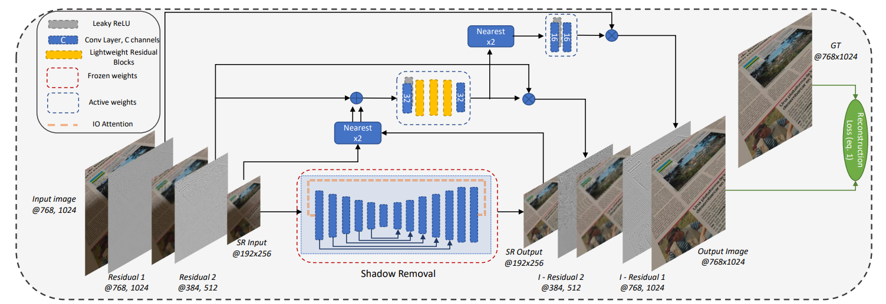

:new: *Please check out the orginal [LP-IOANET: EFFICIENT HIGH RESOLUTION DOCUMENT SHADOW REMOVAL](https://arxiv.org/pdf/2303.12862).*

# Implementation and Extention of LP-IOANET: Efficient High-Resolution Document Shadow Removal

Welcome to the LP-IOANET repository, an implementation and extension of the LP-IOANET model for efficient high-resolution document shadow removal.

## Introduction

LP-IOANET is a state-of-the-art model designed for document shadow removal tasks. Originally proposed in the paper [LP-IOANET: Efficient High-Resolution Document Shadow Removal](https://arxiv.org/pdf/2303.12862), it offers impressive performance in removing shadows from documents while preserving image details.

This repository provides a PyTorch implementation of LP-IOANET, along with pretrained layers of MobileNet for feature extraction. It also includes enhancements and extensions to the original model architecture.

## Model Architecture

The LP-IOANET model architecture consists of encoder and decoder blocks, incorporating attention mechanisms for better feature extraction and shadow removal. For a detailed overview of the architecture, refer to the [original LP-IOANET paper](https://arxiv.org/pdf/2303.12862).



## Code

### Tree Structure

The repository is structured as follows:

```bash
├───ada_sripts
│   └───working
├───analysis
├───LP_IONET_model_def
│   ├───IOnet
│   │   ├───IOnetv1
│   │   │   ├───ATT
│   │   └───IOnetv2
├───trained_models
└───training_scripts
```
### ada_scripts

This directory contains the scripts that were used to train the model. The scripts are divided into one sub directory:

- `working`: Contains the final scripts that were used for training the model.

### analysis

This directory contains the scripts that were used to analyze the model

### LP_IONET_model_def

This directory contains the model definition directory. 

- `IOnet`: Contains the model definition for the LP-IONET model. The model is divided into two sub directories:
  - `IOnetv1`: Contains the model definition for the original LP-IONET model.
  - `IOnetv2`: Contains the model definition for the enhanced LP-IONET model.

  > get_LP_IONET_model.py: This script is used to get the LP-IONET model.

### trained_models

contains the trained models.

### training_scripts

contains the scripts that were used to train the model.

# Resources
[1]https://ieeexplore.ieee.org/iel7/10094559/10094560/10095920.pdf